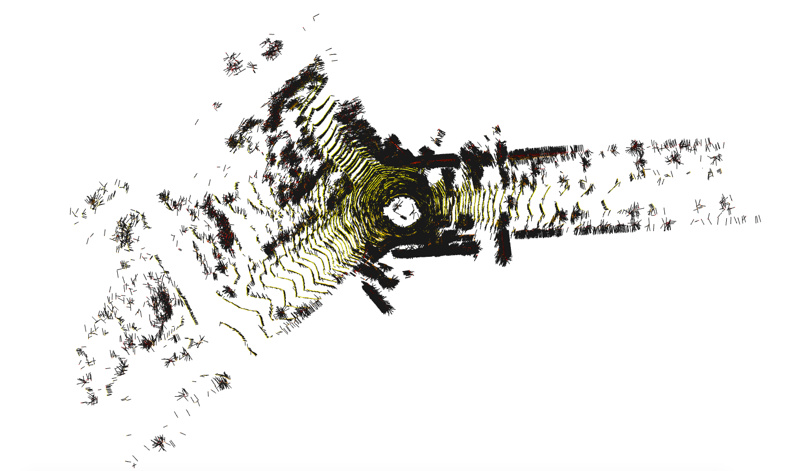
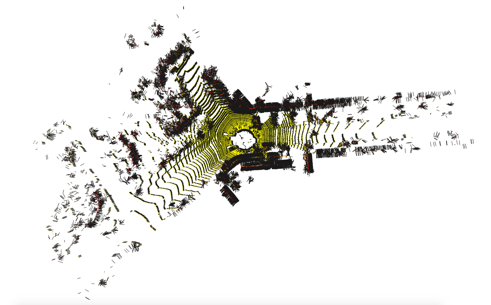
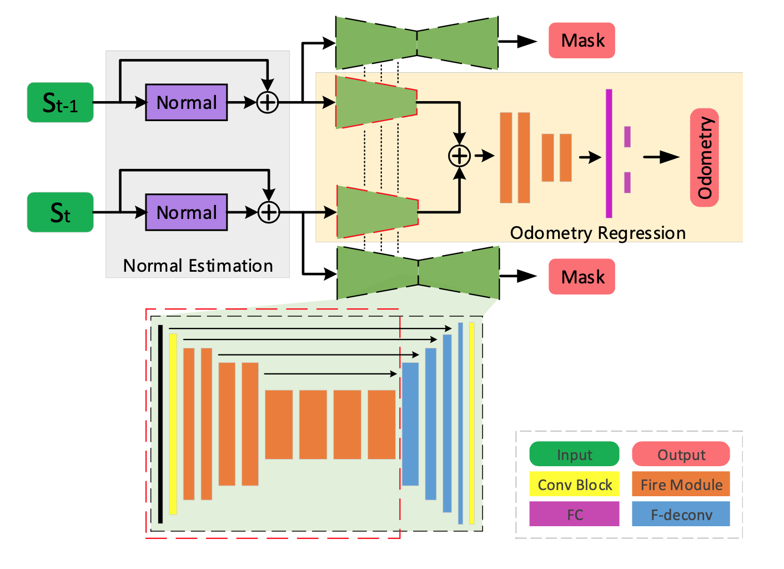

# PyTorch LO-Net
__Deep Real-time Lidar Odometry__

1. Introduction

This is an unofficial notebook implementation of the LO-Net paper (https://arxiv.org/abs/1904.08242), a deep convolutional network pipeline for real-time lidar odometry estimation. 

# Update: 
The project is still unfinished with regards to training the network on the full KITTI dataset, and so results are still very much sub-optimal.

## Comparison of methods for Normal estimation

| Paper             | Open3d             |
|:--------------------------:|:--------------------------:|
|  |  |

## Network overview

<p align="center">  </p>

### __Dependencies__

- pytorch (> v1.7)
- tensorboard 
- scipy
- open3d 
- tqdm (optional)

### __Dataset__

__Downloading KITTI__

Instructions for downloading the dataset can be found at : http://www.cvlibs.net/datasets/kitti/eval_odometry.php
At the end, sequences should be extracted under a directory as follows: 
```
KITTI
|
 sequences|
        |-> 00
            |-> image0 ...
            |-> velodyne
            |-> calib.txt
            |-> times.txt
        .
        .
        .
        |-> 21
            .
            .
            .
 poses|
        |-> 00.txt
        .
        .
        |-> 10.txt
```
